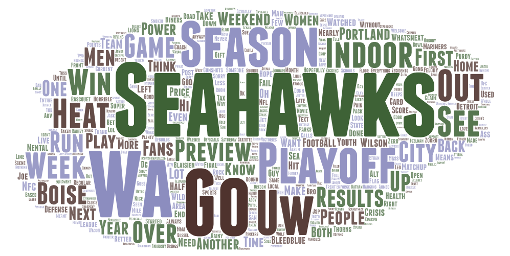
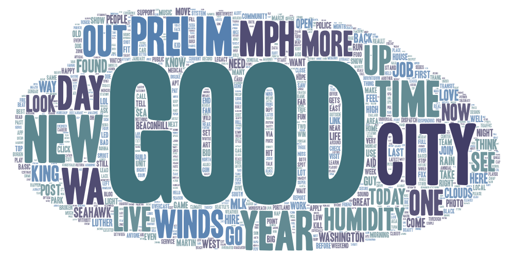
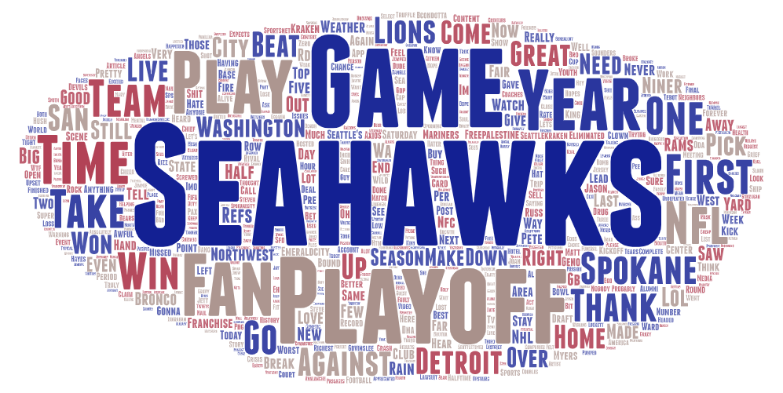
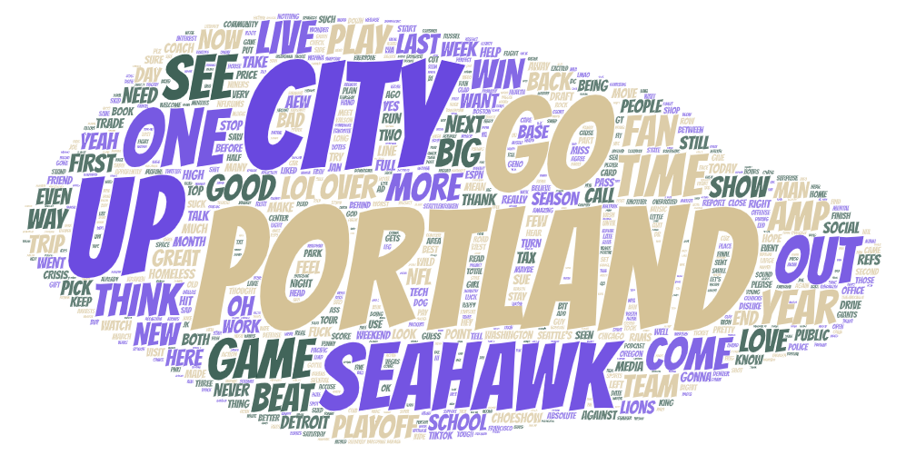

# GEOG 458 - Lab 2
### Calvin Standaert

## Twitter Search Discussion:

### Topic:

The topic I wanted to focus on in my comparison was “how do people talk about Seattle in the largest cities in the American Pacific Northwest”. To this end, the search terms I used were “Seattle” and “Emerald City” which together returned a sufficient amount of tweets in each of my chosen locations. The locations I chose to conduct my tweet searches in were Seattle; Washington, Portland; Oregon, Boise; Idaho, and Spokane; Washington. These cities were chosen because they have the largest populations among all the American cities in the Pacific Northwest Region. Overall, all searches were conducted on January 16th, 2023, and collected tweets from as far back as January 8th, 2023.

### Reason for Comparison:

I wanted to conduct my comparative analysis on how the city of Seattle is spoken about for a couple of main reasons. The first reason is that in my experience, the city of Seattle can be a very divisive subject due to the political and social movements that happen in the city. Due to my suspicions that Seattle would be talked about in a political/social context, I wanted to see what different opinions are taken about Seattle’s associated politics and social movements in nearby cities. Besides politics and social movements, a second reason that made me interested in an analysis of how Seattle is talked about is that the city of Seattle is an important economic center, so I wanted to see if there were opinions of Seattle talked about in other cities due to Seattle’s economic presence. Finally, a last reason I wanted to analyze how Seattle is talked about is to see if there were any topics or words that were associated with Seattle that I wasn’t familiar with.

### Comparison:

Looking at the word clouds, I believe that we can see there is a high degree of similarity shared between each of the word clouds.

One clear similarity shared between all of the word clouds is that each has a strong focus on sports, with very many words related to the Seahawks football team, and football in general appearing. More specifically, each word cloud contains numerous football team names, player and coach names, commentator names, and other terms related to football. Besides football, another similarity in all of the word clouds is that they each contain a moderate amount of words related to economics/economic transactions (tax, buy, price, sell), the legal system (police, sue, lawsuit, court), schools (UW, school, students) and time units (year, month, weekend). Though not readily apparent in the Portland word cloud, the word clouds of Seattle, Boise, and Spokane all also contain similar terms related to weather, such as weather, rain, and humidity.

Due to the high degree of similarity between the word clouds, there are only a few differences that make each word cloud distinct. Probably the greatest difference between the word clouds is the number of words in each word cloud, with some word clouds having smaller pools of words, and others having larger pools of words. Ranking each word cloud by size, the Seattle word cloud has by far the most words, followed by Spokane, then Portland, and finally Boise. A second major difference between the word clouds is found in the terms left over after excluding all the major shared words/topics. After excluding the shared terms, the Seattle word cloud had words related to transportation and Martin Luther King Jr (transit, WADOT, MLK), the Boise word cloud had words related to crimes (murder, gunshot), the Spokane word cloud contained negatively-charged terms (shit, hate, and awful), and the Portland word cloud had words concerning popular media (TikTok, ChoeShow).

### Reasoning for Patterns:

I think that the patterns observed in the resulting data can be explained by some key reasons. 

Concerning the pattern of sports-related talk, I think that the main reason so much of the data was dominated by sports talk is that football and other sports are very popular among those who use Twitter in each location. Additionally, I think the reason why the Seahawks and Seahawks player words were so common is that Seattle is the only city in the region with an NFL team, and thus it is likely that the Seahawks are also the main team for football fans in the other cities. Also worth noting in explaining the commonality of Seahawks/football talk is that the time I gathered my data was near the weekend when football is played and was also amidst the football playoffs/season, which is when football fans are more likely to be active. 

With the terms surrounding weather found in the word clouds of Seattle, Spokane, and Boise (but not Portland), I think that the words related to weather may have occurred at high frequency because people were talking about the weather in Seattle or talking about weather systems affecting their city that also affected Seattle.

Looking at the word related to economics, I believe that the reason why words like buy, tax, and sell occurred in each word cloud probably has something to do with people describing the economic situation in Seattle, talking about the recent rise in taxes proposed by certain liberal states/cities (such as Seattle), or more generally explaining their disdain with the way taxes are currently handled in Seattle. I think that this reason is essentially the same as why topics related to the legal system were popular, as people were talking about legal issues in Seattle, asserting an opinion related to Seattle legal proposals, or describing how they feel about certain Seattle legal cases.

Considering the talk about schools, I think a possible explanation is that people were discussing Seattle schools like UW, or discussing topics related to the Seattle educational system. In a somewhat similar vein, I think that the talk of time units in Seattle-related tweets may have been due to people discussing events in Seattle, or possibly due to people talking about Seattle sports time frames including player contract timelines or time-dependent team decisions.

Next, I think that a possible explanation for the difference in the number of words contained in each word cloud is due to a mix of differing city population sizes, and to a lesser degree, differences in how popular talking about Seattle is in each city. I think this would make sense because the city of Seattle has the largest population and the largest amount of words, while the city of Boise has the lowest amount of words and the lowest population. Under this explanation, we could also understand the difference between the number of Spokane and Portland words as being related to differing interests in talking about Seattle as opposed to being solely related to city population sizes.

Finally, I think we can explain the differences in the popularity of smaller topics within each city as being a result of local interests associated with Seattle, or the topics that are locally associated with Seattle.

### How Future Research Could Be Improved:

If I were to conduct a similar analysis in the future, there would be a few things I think could be changed to improve the results. The first thing change I would make is to devise another system for reviewing the words that are more than simply searching through a list of the resulting words. I think that this could improve the research as the simple search I did for this analysis was time-consuming and likely missed many erroneous words due to the difficulty of manually searching. Instead of manually searching through the results, I think the research could be improved by first checking the resulting words against a dictionary of valid English words to weed out many of the erroneous entries. This change would expedite the analysis process and thus allow for greater data amounts to be processed.

Another thing that could be improved in future research is how the results of tweets are gathered (specifically how each word in the text of a tweet is recorded). The main reason for this change is that many words from individual tweets were recorded with non-English characters, which made it necessary to discard a large amount of unparseable words. Discarding many words no doubt impacts the results and thus is a chief concern for word frequency analysis. To fix this issue, something would need to be done to extract the tweets without changing the characters in the tweets, thus preserving more of the words.

A third thing I would likely change to improve my future research is to focus the search criteria a bit more to gather data specifically related to a key topic. For example, if I were doing this same search again, I would try and add keywords in my search criteria that would help filter out tweets related to football or sports, which would help gather tweets that discuss the city of Seattle more specifically. This change in concert with a focused topic would likely result in much more meaningful results and overall improve my research quality.

Finally, my research in the future could be improved by gathering data from each location many times over longer periods or by gathering historical tweets from greater periods. This change is important because, in the research done for this assignment, I was only able to gather a limited amount of tweets from a narrow period. These constraints on data collection are likely to vastly reduce the analysis quality as the tweets gathered are much more likely to be impacted by short-term trends in tweeting, such as by football games or key political movements. Expanding the number of tweets gathered would mean that my analysis would be much more robust and more likely to accurately depict how Seattle is tweeted about in main Pacific Northwest cities.

### Difference from Expectations:

Overall, the results I obtained from my research differed from my expectations in some major ways. I think the clearest difference from my expectations that the results yielded was how much sports that would be talked about in conversations about Seattle. I had expected that the talk about Seattle would be more focused on Seattle’s reputation or political impact, and so I was surprised to find that the tweets related to Seattle were dominated by Seattle’s football team and football players.

Another big difference from my expectations is that the discussion about Seattle was very unfocused, and the resulting word clouds did not seem to contain any key insights about how people in other large Pacific Northwest cities talk about Seattle. This difference was especially important given how some important terms were talked about, but they were small and the word cloud format meant that they could not easily be attached to opinions.

A last difference from expectations is that the word clouds produced from the tweets were fairly homogenous and differed in seemingly minor ways. This difference was somewhat surprising, as I had thought that the people in each city would talk about Seattle in starkly different contexts.

Besides differences in expectations, I think that the clearest thing that stands out to me from my analysis is that good word cloud analysis is difficult and the words returned by a tweet search may not necessarily align with expectations. Where I had assumed that my tweet search would enable a clear analysis of opinions of Seattle, I instead found that word clouds can be jumbled messes and the tweets that I gathered talked about my topic of interest much less than those topics I hadn’t anticipated.

### Word Clouds:
#### Boise:

[Boise Tweet Search Data](./assets/twsearch-result-Boise.csv)
 
#### Seattle:

[Seattle Tweet Search Data](./assets/twsearch-result-Seattle.csv)
 
#### Spokane:

[Spokane Tweet Search Data](./assets/twsearch-result-Spokane.csv)
 
#### Portland:

[Portland Tweet Search Data](./assets/twsearch-result-Portland.csv)